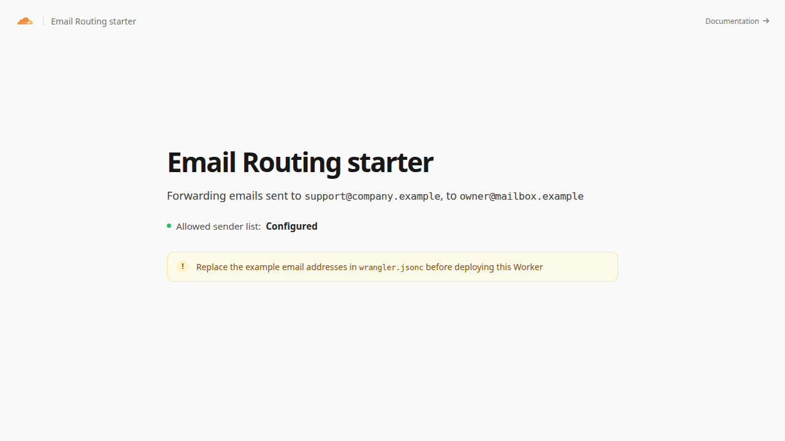

[](https://deploy.workers.cloudflare.com/?url=https://github.com/cloudflare/templates/tree/main/email-routing-template)

# Email Routing Worker

Forward incoming email from approved senders to a verified destination address with Cloudflare Email Routing.

<!-- dash-content-start -->

This starter uses an Email Worker to forward messages from a configurable sender allowlist to one verified destination. Its top-level Wrangler `addresses` configuration creates and maintains the Email Routing rules that invoke the Worker.

The Worker rejects messages from unapproved senders and fails closed when its destination or allowlist is missing.

It uses [Email Routing](https://developers.cloudflare.com/email-service/email-routing/) for inbound delivery, a [Workers email handler](https://developers.cloudflare.com/email-service/api/route-emails/email-handler/) for forwarding decisions, and [Workers Assets](https://developers.cloudflare.com/workers/static-assets/) for the setup page.

<!-- dash-content-end -->



## How it works

1. Email Routing receives a message for an address declared in `wrangler.jsonc`.
2. The Worker compares the SMTP envelope sender with `ALLOWED_SENDERS`.
3. Approved messages are forwarded to `FORWARD_TO`; all other messages are rejected.

The template uses TypeScript without an application framework. Its `ASSETS` binding serves the static setup page, while the email event handler processes incoming messages.

## Prerequisites

- A domain on Cloudflare with Email Routing enabled.
- A verified Email Routing destination address.

## Configure the Worker

Set these variables in `wrangler.jsonc` or during deployment:

- `ROUTE_ADDRESS`: The Email Routing address shown on the setup page. Keep it in sync with the top-level `addresses` configuration.
- `FORWARD_TO`: The verified destination that receives forwarded messages.
- `ALLOWED_SENDERS`: A comma-separated list of sender addresses allowed to use the route.

Then uncomment the top-level `addresses` section in `wrangler.jsonc` and replace its example address:

```jsonc
"addresses": ["support@company.example"]
```

Use `"*@company.example"` instead to route every otherwise-unmatched address on a domain to this Worker.

The setup page displays `ROUTE_ADDRESS` and `FORWARD_TO`, and indicates whether an allowlist exists without exposing its contents. It also warns while any email setting still contains example data.

The `addresses` field is managed by Wrangler. On deployment, Wrangler reconciles Email Routing rules for this Worker with the configured list. Review destructive changes carefully before accepting them.

## Develop locally

```sh
npm install
npm run dev
```

The local HTTP page shows setup guidance. To test incoming email handling, use the Email Routing local-development instructions in the [Cloudflare documentation](https://developers.cloudflare.com/email-service/local-development/routing/).

A live preview is provisioned during template review at [email-routing-template.templates.workers.dev](https://email-routing-template.templates.workers.dev).

## Test

```sh
npm test
npm run check
```

## Deploy

```sh
npm run deploy
```

After deployment, send a message from an address in `ALLOWED_SENDERS` to one of the configured routing addresses.
