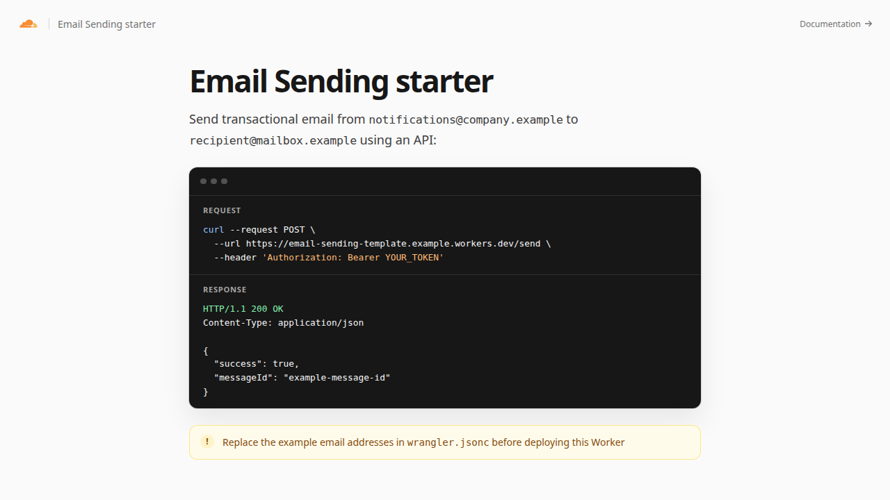

[](https://deploy.workers.cloudflare.com/?url=https://github.com/cloudflare/templates/tree/main/email-sending-template)

# Email Sending Worker

Send a fixed transactional email securely with the Cloudflare Email Service binding.

<!-- dash-content-start -->

This starter exposes an authenticated endpoint that sends one fixed message from and to configured addresses. It uses the structured Email Service message builder and returns the resulting message ID.

The endpoint never accepts sender or recipient addresses from a request, preventing it from becoming an open email relay.

It uses the [Email Service Workers API](https://developers.cloudflare.com/email-service/api/send-emails/workers-api/) to deliver messages, [Hono](https://hono.dev/) to route the API request, and [Workers Assets](https://developers.cloudflare.com/workers/static-assets/) for the setup page.

<!-- dash-content-end -->



## How it works

1. A client sends an authenticated `POST /send` request.
2. Hono validates the bearer token and checks the configured addresses.
3. The `EMAIL` binding sends a fixed transactional message and returns its message ID.

The `ASSETS` binding stores the setup page. Requests to `/` run the Worker first so it can display the configured sender and warn about example addresses; `/send` runs the email API.

## Prerequisites

- A domain on Cloudflare that can be used as the sender domain.
- A verified destination address, or a sending domain onboarded to Email Service for arbitrary recipients.
- Workers Paid when sending to arbitrary recipients. Sending to verified destination addresses is available on all Workers plans.

## Configure the Worker

Replace these variables in `wrangler.jsonc` or during deployment:

- `FROM_ADDRESS`: The sender address on your Email Service domain.
- `TO_ADDRESS`: The fixed recipient for this starter.

Create the bearer-token secret:

```sh
npx wrangler secret put SEND_EMAIL_AUTH_TOKEN
```

Generate a strong value with `openssl rand -hex 32`. Do not put a production token in source control or browser code.

## Send an email

```sh
curl --request POST https://YOUR_WORKER.workers.dev/send \
  --header "Authorization: Bearer YOUR_TOKEN"
```

The request body is ignored. Customize the fixed subject and content in `src/index.ts` for your transactional use case.

## Develop locally

```sh
cp .dev.vars.example .dev.vars
npm install
npm run dev
```

The production Wrangler configuration sets the Email Service binding to `remote: true`. Calling the local `/send` endpoint therefore sends a real email. Use test addresses and tokens, or run the E2E configuration for local simulation:

```sh
npm run e2e:dev
```

The E2E configuration logs and saves messages locally instead of delivering them.

A live preview is provisioned during template review at [email-sending-template.templates.workers.dev](https://email-sending-template.templates.workers.dev).

## Test

```sh
npm test
npm run check
```

## Deploy

```sh
npm run deploy
```
