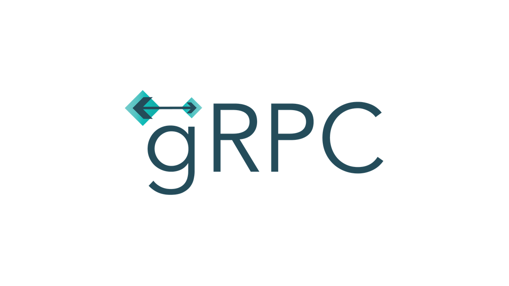

# gRPC Container

[](https://deploy.workers.cloudflare.com/?url=https://github.com/cloudflare/templates/tree/main/grpc-container-template)



<!-- dash-content-start -->

Run a bidirectional streaming gRPC service inside a Cloudflare Container and
proxy its raw bytes through a Worker and Durable Object.

This template combines:

- A Worker `connect()` handler for inbound TCP streams.
- A Durable Object `connect()` handler that owns the Container instance.
- The low-level Container TCP port API for reaching the gRPC server.
- A small HTTP landing page that documents the running architecture.

The Worker does not parse or terminate gRPC. It streams bytes in both directions,
leaving HTTP/2 and gRPC handling to the service inside the Container.

<!-- dash-content-end -->

Outside of this repository, create a new project from the template with
[C3](https://developers.cloudflare.com/pages/get-started/c3/) (`create-cloudflare`):

```sh
npm create cloudflare@latest -- --template=cloudflare/templates/grpc-container-template
```

## Architecture

```text
gRPC client
    │
    │ raw TCP
    ▼
Worker.connect()
    │
    │ GRPC_CONTAINER.getByName(...).connect()
    ▼
GrpcContainer.connect()
    │
    │ ctx.container.getTcpPort(50051).connect()
    ▼
gRPC server in the Container
```

The same Worker also serves an HTTP overview at port `8787` during local
development. The gRPC listener uses port `8788`.

## Prerequisites

- Node.js 20.16 or newer
- Docker running locally
- Access to Cloudflare Containers for deployment
- Access to inbound TCP Workers for a deployed gRPC endpoint

## Getting Started

Install dependencies:

```sh
npm install
```

Start the Worker, Durable Object, and Container:

```sh
npm run dev
```

Open [http://localhost:8787](http://localhost:8787) to view the architecture.
Wrangler listens for local gRPC traffic at `127.0.0.1:8788`.

In another terminal, run the included streaming client:

```sh
npm run grpc:client
```

The client receives a greeting, sends a sequence of byte payloads, receives an
echo for each payload, half-closes its request stream, and receives a final
goodbye.

## Testing

Run the Worker unit tests:

```sh
npm test
```

Run the complete local tunnel smoke test:

```sh
npm run test:e2e
```

The end-to-end test starts Wrangler, connects the included gRPC client to port
`8788`, and verifies traffic traverses the Worker, Durable Object, and Container.
Docker must be running.

## Deploying

Deploy the Worker and Container:

```sh
npm run deploy
```

The public hostname and port for the raw TCP listener depend on the inbound TCP
configuration available to your Cloudflare account. The HTTP overview remains
available at the Worker's normal URL.

## Project Structure

- `src/index.ts` implements the HTTP and raw TCP Worker handlers plus the
  Durable Object.
- `src/ui.ts` renders the HTTP architecture overview.
- `container/server.js` implements the bidirectional gRPC service.
- `container/client.js` is a small test client.
- `proto/bytes.proto` defines the streaming service.
- `scripts/smoke-test.mjs` verifies the complete local data path.

## Learn More

- [Cloudflare Containers](https://developers.cloudflare.com/containers/)
- [Durable Object Container API](https://developers.cloudflare.com/durable-objects/api/container/)
- [Workers TCP sockets](https://developers.cloudflare.com/workers/runtime-apis/tcp-sockets/)
- [Workers protocol support](https://developers.cloudflare.com/workers/reference/protocols/)
