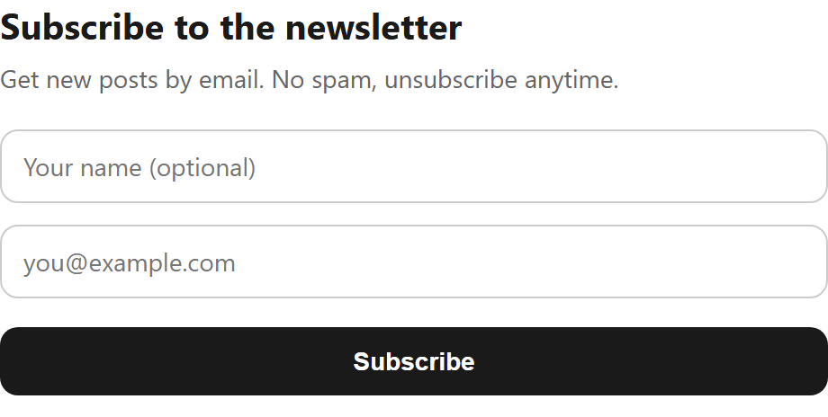
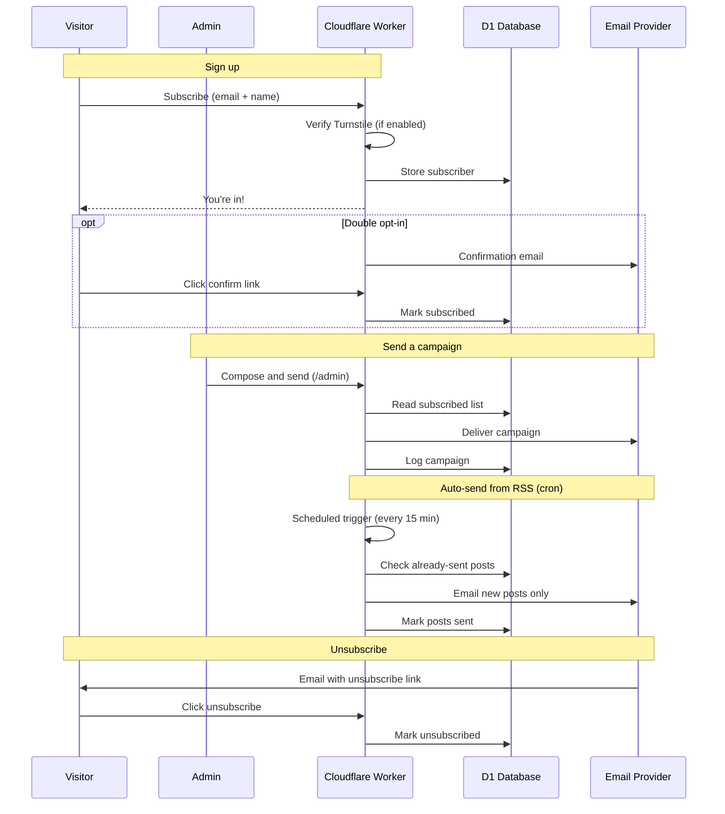

# Newsletter

[](https://deploy.workers.cloudflare.com/?url=https://github.com/cloudflare/templates/tree/main/newsletter-template)



<!-- dash-content-start -->

A complete, self-hosted newsletter on your own Cloudflare account: a signup
form, one-click unsubscribe, and a simple page to send an email campaign to
your subscribers. **You own the data** (Cloudflare D1) and **bring your own
email sender** — connect any provider you like.

No servers, no monthly SaaS bill, no command line: it runs on Cloudflare
Workers + D1 and stays comfortably inside the free tier for small and medium lists.

## What you get

- **Signup** — a hosted form at `/`, an embeddable version for your own site, and a `POST /api/subscribe` endpoint
- **One-click unsubscribe** — RFC 8058 compliant, with a per-subscriber token
- **Send** — a `/admin` page: paste a subject + HTML, send a test to yourself, then send to everyone
- **Your data** — subscribers live in a D1 database on _your_ account, exportable any time
- **Double opt-in** _(optional)_ — a confirmation-email step before a subscriber is added
- **Bot protection** _(optional)_ — Cloudflare Turnstile on the signup form
- **Automatic RSS sending** _(optional)_ — email new blog posts to your list on a schedule

<!-- dash-content-end -->

## Getting started

Click **Deploy to Cloudflare** above. On the single setup screen you can fill in:

- **`ADMIN_TOKEN`** — a password that protects your send page (make up a long random string)
- **`FROM_NAME` / `FROM_EMAIL`** — the name and address your emails come from

Cloudflare then creates the D1 database, applies the schema, deploys the Worker,
and puts a copy of this repo on your account (with CI — every push redeploys).
**No terminal, no `wrangler` commands.**

That's it — your signup page is immediately live at
`https://<your-worker>.workers.dev` and starts collecting subscribers right away.

A live public deployment of this template is available at
[https://newsletter-template.templates.workers.dev](https://newsletter-template.templates.workers.dev).

### Options

Both are off by default. Add them any time in the dashboard under _your Worker →
Settings → Variables and Secrets_ (double opt-in can also be set on the deploy screen):

- **Double opt-in** — set `DOUBLE_OPT_IN` to `"true"` to require new subscribers
  to click a confirmation link before they're added (recommended for CH/EU;
  requires email to be configured, see below). Default is single opt-in.
- **Bot protection ([Turnstile](https://developers.cloudflare.com/turnstile/))** —
  create a Turnstile widget in your Cloudflare dashboard, then set the public
  `TURNSTILE_SITE_KEY` (variable) **and** `TURNSTILE_SECRET_KEY` (secret). The
  signup form then shows the widget and rejects unverified submissions. Leave
  both blank to disable.

## How it works

Everything runs inside a single Cloudflare Worker. The sequence below traces the
main data flows between the participants — laid out left to right: the visitor,
you as admin, the Worker, your D1 database and your email provider.



Turnstile and double opt-in are optional; RSS auto-send runs only when you enable it.

## Collecting subscribers

You don't need to touch any code. Pick whichever fits you:

**1. Just share the link.** Your hosted signup page already works — put it in
your bio, a post, or an email:

```
https://<your-worker>.workers.dev
```

**2. Embed it on your site (recommended).** Paste this one line into any site
builder that allows an "embed" or "custom HTML" block (Webflow, WordPress,
Squarespace, Framer, Notion, …). Nothing else to configure:

```html
<iframe
	src="https://<your-worker>.workers.dev/embed"
	style="width:100%;max-width:420px;height:90px;border:0"
></iframe>
```

**3. Inline form (matches your own styling).** If you'd rather the form be part
of your page, drop in this snippet — it posts straight to your Worker:

```html
<form
	onsubmit="event.preventDefault();
  fetch('https://<your-worker>.workers.dev/api/subscribe', {
    method:'POST', headers:{'Content-Type':'application/json'},
    body: JSON.stringify({ email: this.email.value })
  }).then(()=>this.reset());"
>
	<input name="email" type="email" placeholder="you@example.com" required />
	<button>Subscribe</button>
</form>
```

The form asks for an email and an optional name by default. To collect more
(company, country, …), add entries to [`src/fields.ts`](src/fields.ts) — each one
automatically appears on the form and is stored as JSON in the `data` column. No
other file needs changing. In your emails you can personalize with the
`{{name}}` merge tag.

Already have a list? Import it with
`npx wrangler d1 execute newsletter-template-db --remote --command "..."`.

## Sending email (connect your own provider)

Collecting subscribers works out of the box. Sending is the one part you wire
up yourself — so you keep full control over your email provider, sending domain,
and deliverability, and this template stays tied to no one.

Open [`src/email.ts`](src/email.ts) and implement `sendEmail()` with your
provider's API. Most transactional email services expose a simple HTTP API you
can call straight from a Worker — there's a commented example in that file to
adapt. Then:

1. Add your provider's secret (e.g. an API key) to the Worker: _dashboard →
   your Worker → Settings → Variables and Secrets_, and flip `isEmailConfigured()`.
2. **Verify your sending domain** with your provider (SPF/DKIM DNS records) —
   this is what makes your email land in inboxes.

Then open `https://<your-worker>.workers.dev/admin`, paste your `ADMIN_TOKEN`,
write your email, send a test to yourself, and send to your list. Use
`{{unsubscribe_url}}` anywhere in your HTML for the one-click unsubscribe link.

## Automatic sending from your blog (RSS)

Instead of composing each issue by hand, the Worker can watch your blog's feed
and email subscribers automatically whenever you publish. It's off by default.
To turn it on, add these in the dashboard under _Settings → Variables and Secrets_:

- **`RSS_AUTOSEND`** → `"true"`
- **`RSS_FEED_URL`** → your RSS or Atom feed (e.g. `https://example.com/rss.xml`)
- **`PUBLIC_URL`** → your Worker's URL (e.g. `https://your-worker.workers.dev`),
  so unsubscribe links in the sent emails are absolute
- and your email provider configured (see above)

A scheduled job (every 15 minutes by default — adjust the cron in
`wrangler.json`) checks the feed and sends any new post to your subscribed list,
newest posts in order. Two safeguards are built in: each post is emailed only
once, and the **first run just records your current feed as a baseline** — it
never blasts your back catalogue. Only posts published after you enable it go out.

## Local development

```
npm install
cp .dev.vars.example .dev.vars   # fill in your values
npm run dev                      # applies the schema to a local D1, then starts Wrangler
```

## Notes & limits

- **Single opt-in by default** — simplest to start. Flip `DOUBLE_OPT_IN` to
  `"true"` for a confirmation-email step; it needs your
  email provider wired up so the confirmation link can be sent.
- **Sending is a simple loop** — great for up to a few hundred recipients per send
  (Cloudflare Workers subrequest limits). For larger lists, batch the send via
  [Cloudflare Queues](https://developers.cloudflare.com/queues/).
- **Deliverability is your domain's** — verify your sending domain with your
  email provider (SPF/DKIM). The one-click deploy provisions the backend; it
  can't verify your domain for you.

## License

[MIT](LICENSE) — © Rafael Pfister, [rafaelpfister.ch](https://rafaelpfister.ch). Free to
use, modify and sell; the copyright notice (name + link) must be kept in copies.
