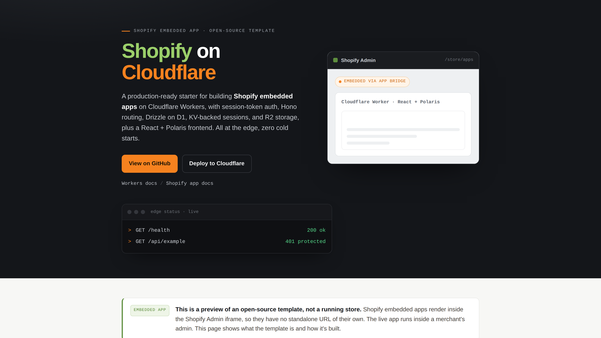

# Shopify on Cloudflare

[](LICENSE)
[](https://workers.cloudflare.com)
[](https://hono.dev)
[](https://shopify.dev)

[](https://deploy.workers.cloudflare.com/?url=https://github.com/cloudflare/templates/tree/main/shopify-on-cloudflare-template)



**🔗 Live preview:** [cloudflare-shopify-starter-template.ali-d43.workers.dev/preview](https://cloudflare-shopify-starter-template.ali-d43.workers.dev/preview) (opens without a Shopify login).

**📦 Source:** [devkindhq/shopify-on-cloudflare](https://github.com/devkindhq/shopify-on-cloudflare) · built by [Devkind](https://devkind.com.au).

**Keywords:** Shopify embedded app, Cloudflare Workers, Hono, Drizzle ORM, D1, KV, R2, React Polaris, session token auth, boilerplate, template, starter

<!-- dash-content-start -->

A production-ready Shopify embedded app boilerplate / template built on Cloudflare Workers. Features session-token auth, Hono routing, Drizzle ORM on D1, KV-backed session storage, R2 file storage, and a React 18 + Shopify Polaris frontend, all running at the edge with zero cold starts.

**Stack:** Cloudflare Workers (Hono) · D1 + Drizzle · KV (sessions) · R2 (files) · React 18 + Vite · Shopify Polaris + App Bridge.

What's wired up out of the box:

- Shopify OAuth + session-token auth (all `/api/*` routes are protected by middleware)
- KV-backed Shopify session storage
- D1 + Drizzle with a single `shopify_shop` table to extend
- Install / uninstall lifecycle, including `app/uninstalled` webhook
- One example protected API route (`GET /api/example`) and one Polaris page that fetches it

What's commented out as opt-in (in `wrangler.jsonc`): Cloudflare Queues, Durable Objects, Cron triggers.

---

## Architecture

```
Browser (Shopify Admin)
  └── App Bridge (session token JWT)
        └── Cloudflare Worker (Hono)
              ├── /shopify/install        → OAuth install start
              ├── /shopify/callback       → OAuth callback, session saved to KV
              ├── /api/*                  → requireShop middleware (JWT verification)
              │     └── GET /api/example → queries D1, returns JSON
              └── /* (static assets)     → React + Polaris SPA (served via [assets])
```

- **Install flow:** `/shopify/install?shop=<shop>` → Shopify consent → `/shopify/callback` → session persisted in `SESSION_KV`.
- **Session-token flow:** App Bridge embeds a short-lived JWT in every API request header; the `requireShop` middleware verifies it and attaches the shop to the request context.
- **Data layer:** Drizzle ORM on D1 (SQLite). All tables cascade-delete on shop removal (`SHOP_REDACT` GDPR pattern).

<!-- dash-content-end -->

---

## Prerequisites

- Node 20+
- A Cloudflare account (free tier is fine)
- A Shopify Partner account + a development app

---

## One-time setup

### 1. Install dependencies

```bash
npm install
```

### 2. Create Cloudflare resources

```bash
# Database
wrangler d1 create shopify-on-cloudflare-db
# → copy the returned database_id into wrangler.jsonc

# KV namespace for Shopify sessions
wrangler kv:namespace create SESSION_KV
# → copy the returned id into wrangler.jsonc

# R2 bucket for file storage
wrangler r2 bucket create shopify-on-cloudflare-files
```

Open `wrangler.jsonc` and replace the `YOUR_*` placeholders (`database_id`, KV `id`) with the values above. (No `account_id` needed, Wrangler uses your logged-in account.)

### 3. Set Shopify secrets

In the Shopify Partner dashboard, create an app and copy its client ID and secret.

```bash
npx wrangler secret put SHOPIFY_CLIENT_ID
npx wrangler secret put SHOPIFY_API_SECRET
npx wrangler secret put HOST           # bare hostname, no protocol, e.g. shopify-on-cloudflare.<you>.workers.dev
```

Copy `.env.example` to `.env` and fill in `VITE_SHOPIFY_CLIENT_ID` (the public client ID).

For **local development**, also copy `.dev.vars.example` to `.dev.vars` and fill in the same Shopify credentials; `wrangler dev` (via the Vite plugin) loads them from there, so you don't need `wrangler secret put` locally.

#### Shopify Partner Dashboard App URLs

After your first deploy (or when using a tunnel locally), set these values in the Shopify Partner Dashboard under **App setup**:

| Field                    | Value                                         |
| ------------------------ | --------------------------------------------- |
| App URL                  | `https://<your-worker-host>/shopify/install`  |
| Allowed redirection URLs | `https://<your-worker-host>/shopify/callback` |

Replace `<your-worker-host>` with your `*.workers.dev` hostname (or custom domain).

### 4. Apply database migrations

```bash
npm run setup                 # local: apply D1 migrations for `npm run dev` (alias for d1:migrate:local)
npm run d1:migrate            # remote: apply D1 migrations to your deployed D1
```

---

## Run locally

First time on a fresh clone, do the one-time setup: copy local vars and apply local migrations:

```bash
cp .dev.vars.example .dev.vars   # then fill in your Shopify credentials
npm run setup                    # apply D1 migrations to the local database
```

Then a single command runs the whole app (React frontend **and** Worker backend) on one port, via the [Cloudflare Vite plugin](https://developers.cloudflare.com/workers/vite-plugin/):

```bash
npm run dev
```

Everything is served at http://localhost:5173, with the Worker running in the real `workerd` runtime and D1, KV, and R2 bound locally.

> **Shopify OAuth requires a public HTTPS URL** even in development.
> Use the included `cloudflared` tunnel to expose your local server:
>
> ```bash
> npm run dev:tunnel   # exposes http://localhost:5173 via a cloudflared HTTPS tunnel
> ```
>
> Copy the printed `https://*.trycloudflare.com` URL and use
> `https://*.trycloudflare.com/shopify/install` as your **App URL** and
> `https://*.trycloudflare.com/shopify/callback` as your **Allowed redirection URL**
> in the Shopify Partner Dashboard for the duration of the dev session.

Seed a test shop and hit the example endpoint:

```bash
wrangler d1 execute shopify-on-cloudflare-db --local --command "
  INSERT OR IGNORE INTO shopify_shop (id, myshopify_domain, domain, name, status, install_date)
  VALUES ('test-shop-id', 'mystore.myshopify.com', 'mystore.myshopify.com', 'Test Store', 'installed', datetime('now'));
"

curl http://localhost:5173/api/example -H "x-shop-domain: mystore.myshopify.com"
# → {"shopId":"test-shop-id","now":"2026-..."}
```

---

## Testing

```bash
npm test           # unit tests (Vitest)
npm run test:e2e   # end-to-end smoke tests (Playwright)
```

The Playwright suite boots the app with `npm run dev` and checks the health endpoint, that protected `/api/*` routes reject unauthenticated requests, and that the SPA shell is served.

---

## Deploy

```bash
npm run deploy
```

`npm run deploy` builds the frontend and Worker together (`vite build`) and ships them with `wrangler deploy`.

---

## What's next

- Add tables: edit `src/db/schema.ts`, run `npm run d1:generate`, then `npm run d1:migrate`. New tables should have a non-null `shopId` FK to `shopify_shop` with `onDelete: 'cascade'` (GDPR `SHOP_REDACT` pattern).
- Add routes: drop a new file in `src/routes/`, export a Hono router, wire it in `src/index.ts`. `/api/*` paths are auth-guarded automatically.
- Add background jobs: uncomment the queues / durable-objects / cron blocks in `wrangler.jsonc` and add the matching `queue` / `scheduled` export to `src/index.ts`.
- Add a webhook topic: extend `TOPICS` in `src/lifecycle/webhooks.ts` and dispatch it in the handler.

---

## Optional integrations

### Bugsnag (error monitoring)

The frontend bundles `@bugsnag/js` and `@bugsnag/plugin-react`. To enable it, set your API key:

```bash
# .env (Vite/frontend)
VITE_BUGSNAG_API_KEY=your-bugsnag-api-key
```

If you do not use Bugsnag, you can safely remove `@bugsnag/js` and `@bugsnag/plugin-react` from `package.json` and delete the Bugsnag initialisation call in the frontend entry point.

---

## Contributing

Contributions, bug reports, and feature requests are welcome.

1. Fork the repository and create a branch from `main`.
2. Make your changes, keeping commits focused and atomic.
3. Follow the commit message convention enforced by `commitlint` (Conventional Commits: `feat:`, `fix:`, `chore:`, etc.).
4. Open a pull request: describe what you changed and why.

For significant changes, open an issue first to discuss the approach.

---

## License

MIT, see [LICENSE](LICENSE).
