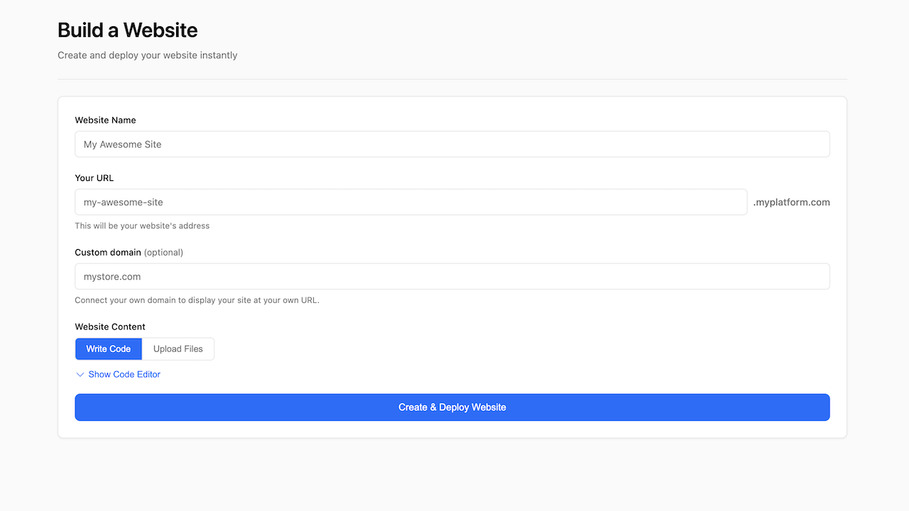

# Website Builder

Build your own website hosting platform using [Cloudflare Workers for Platforms](https://developers.cloudflare.com/cloudflare-for-platforms/workers-for-platforms/). Users can create and deploy websites through a simple web interface.

[](https://deploy.workers.cloudflare.com/?url=https://github.com/cloudflare/templates/tree/main/workers-for-platforms-template)



<!-- dash-content-start -->

## Features

- **Website Builder UI** - Web interface for creating and deploying sites
- **Static Site Hosting** - Drag & drop HTML/CSS/JS files with automatic asset handling
- **Custom Worker Code** - Write dynamic sites with full Workers capabilities
- **Subdomain Routing** - Each site gets `sitename.yourdomain.com`
- **Custom Domains** - Users can connect their own domains with automatic TLS certificates (powered by custom hostnames)
- **Admin Dashboard** - Manage all sites and monitor deployment status at `/admin`

## How It Works

This template demonstrates how to build a multi-tenant platform using Workers for Platforms:

1. **Dispatch Namespace** - A container that holds all user-deployed Workers. Each user site is a separate Worker script within this namespace.

2. **D1 Database** - Stores project metadata including site names, subdomains, custom hostnames, and deployment timestamps.

3. **Dynamic Routing** - The main Worker routes requests to the appropriate user Worker based on subdomain or custom hostname.

4. **Custom Hostnames** - Enables custom domain support with automatic TLS certificate provisioning.

## Bindings Used

- **dispatcher** (Workers for Platforms) - Routes requests to user-deployed Workers
- **DB** (D1) - Stores project metadata and configuration

<!-- dash-content-end -->

---

## Quick Start

Click the **Deploy to Cloudflare** button above. Everything is auto-configured!

### Optional: Custom Domain

If you want to use your own domain instead of `*.workers.dev`:

| Variable        | Description                             |
| --------------- | --------------------------------------- |
| `CUSTOM_DOMAIN` | Your root domain (e.g., `platform.com`) |

---

## Architecture

```
┌─────────────────────────────────────────────────────────────┐
│  Your Platform (this template)                              │
├─────────────────────────────────────────────────────────────┤
│  platform.com              → Website Builder UI             │
│  platform.com/admin        → Admin Dashboard                │
├─────────────────────────────────────────────────────────────┤
│  User Sites (Workers for Platforms)                         │
│  ├── site1.platform.com    → User's deployed Worker         │
│  ├── site2.platform.com    → User's deployed Worker         │
│  └── custom.userdomain.com → Custom domain with SSL         │
├─────────────────────────────────────────────────────────────┤
│  my.platform.com           → Fallback origin for CNAMEs     │
└─────────────────────────────────────────────────────────────┘
```

---

## Local Development

```bash
# Clone the repository
git clone https://github.com/cloudflare/templates.git
cd templates/workers-for-platforms-template

# Install dependencies
npm install

# Run interactive setup (creates tokens, configures everything)
npm run setup

# Start local development server
npm run dev

# Run tests
npm test
```

The setup script will:

- Validate your Cloudflare credentials
- Create the dispatch namespace for Workers for Platforms
- Auto-create API tokens with correct permissions (if needed)
- Generate `.dev.vars` with all required configuration
- Update `wrangler.jsonc` with your settings

---

## Custom Domain Setup

To use your own domain instead of `*.workers.dev`:

### 1. Update `wrangler.jsonc`

```jsonc
{
	"vars": {
		"CUSTOM_DOMAIN": "platform.com",
	},
	"routes": [{ "pattern": "*/*", "zone_name": "platform.com" }],
	"workers_dev": false,
}
```

### 2. Add DNS Records

In your Cloudflare DNS settings for `platform.com`:

| Type | Name | Content     | Result            | Proxy   |
| ---- | ---- | ----------- | ----------------- | ------- |
| A    | `*`  | `192.0.2.1` | `*.platform.com`  | Proxied |
| A    | `my` | `192.0.2.1` | `my.platform.com` | Proxied |

> **Note:** The root domain (`platform.com`) is automatically configured when you add a custom domain to your Worker in the Cloudflare dashboard. The `192.0.2.1` is a dummy IP - Cloudflare's proxy handles the actual routing.

**About the Fallback Origin (`my.platform.com`):**

This is the hostname your customers will CNAME their custom domains to. When a user wants to connect their own domain (e.g., `shop.example.com`), they add:

```
CNAME  shop.example.com  →  my.platform.com
```

Cloudflare uses this fallback origin to route traffic for custom hostnames.

### 3. Redeploy

```bash
npm run deploy
```

---

## Security

The admin page (`/admin`) shows all projects. Protect it with [Cloudflare Access](https://developers.cloudflare.com/cloudflare-one/applications/configure-apps/self-hosted-apps/):

1. Go to **Zero Trust** → **Access** → **Applications**
2. Add application for `platform.com/admin*`
3. Configure authentication policy

---

## Troubleshooting

| Problem                                     | Solution                                                                                                                                                 |
| ------------------------------------------- | -------------------------------------------------------------------------------------------------------------------------------------------------------- |
| "Dispatch namespace not found"              | Enable Workers for Platforms: [dash.cloudflare.com/?to=/:account/workers-for-platforms](https://dash.cloudflare.com/?to=/:account/workers-for-platforms) |
| "Custom domain not working"                 | Check Zone ID and DNS records are correct                                                                                                                |
| "Custom hostnames require additional setup" | Custom hostname tokens are auto-provisioned during Deploy to Cloudflare                                                                                  |
| "404 on deployed sites"                     | Ensure uploaded files include `index.html` at the root                                                                                                   |
| Database errors                             | Visit `/admin` to check status, or `/init` to reset                                                                                                      |

**View logs:**

```bash
npx wrangler tail
```

---

## Prerequisites

- **Cloudflare Account** with Workers for Platforms enabled
  - [Purchase Workers for Platforms](https://dash.cloudflare.com/?to=/:account/workers-for-platforms) or contact sales (Enterprise)
- **Node.js 18+**

---

## Learn More

- [Workers for Platforms Docs](https://developers.cloudflare.com/cloudflare-for-platforms/workers-for-platforms/)
- [Custom Hostnames](https://developers.cloudflare.com/cloudflare-for-platforms/cloudflare-for-saas/)
- [D1 Database](https://developers.cloudflare.com/d1/)
- [Hono Framework](https://hono.dev/)

## License

Apache-2.0
