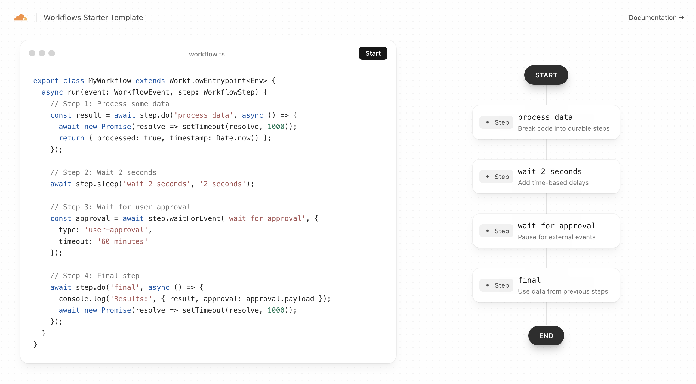

# Cloudflare Workflows Starter Template

[](https://deploy.workers.cloudflare.com/?url=https://github.com/cloudflare/templates/tree/main/workflows-starter-template)

<!-- dash-content-start -->

A real-time, interactive demonstration of [Cloudflare Workflows](https://developers.cloudflare.com/workflows) with live updates via WebSockets and Durable Objects. This template showcases durable multi-step workflows with time-based delays, event-driven pauses, and real-time status visualization.

<!-- dash-content-end -->



## Getting Started

### Installation

```bash
npm install
```

### Development

```bash
npm run dev
```

Visit `http://localhost:5173` to see the interactive demo.

### Deployment

```bash
npm run deploy
```

## Learn More

- [Cloudflare Workflows Documentation](https://developers.cloudflare.com/workflows)
- [Durable Objects Documentation](https://developers.cloudflare.com/durable-objects)
- [Workers Documentation](https://developers.cloudflare.com/workers)
